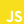

    

<samp>
  
## ➤ Hi there 👋, I'm Paulo

Front-End Developer | Self-Taught Programmer

## ➤ About me 

- I'm from Pará - Brasil
- I’m currently self-teaching myself about programming in general.
- I'm learning JavaScript, ReactJS, TypeScript, NextJS and things related to Front End.
- Working as a Frontend Developer

 
## ➤ My stats

## ➤ Technologies
	

	
	
  	
  	
  	
	
  	
	

	
## ➤ Contact me

 
 

  
## ➤ Support

  
